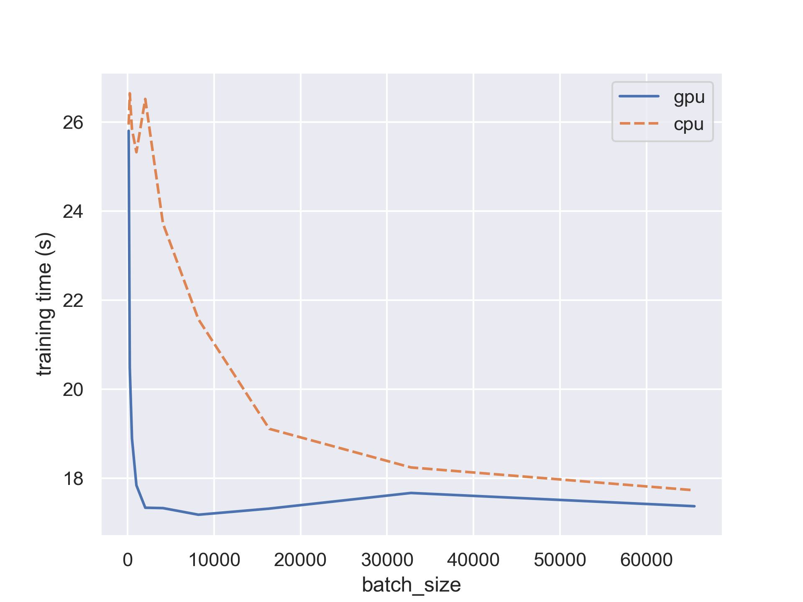
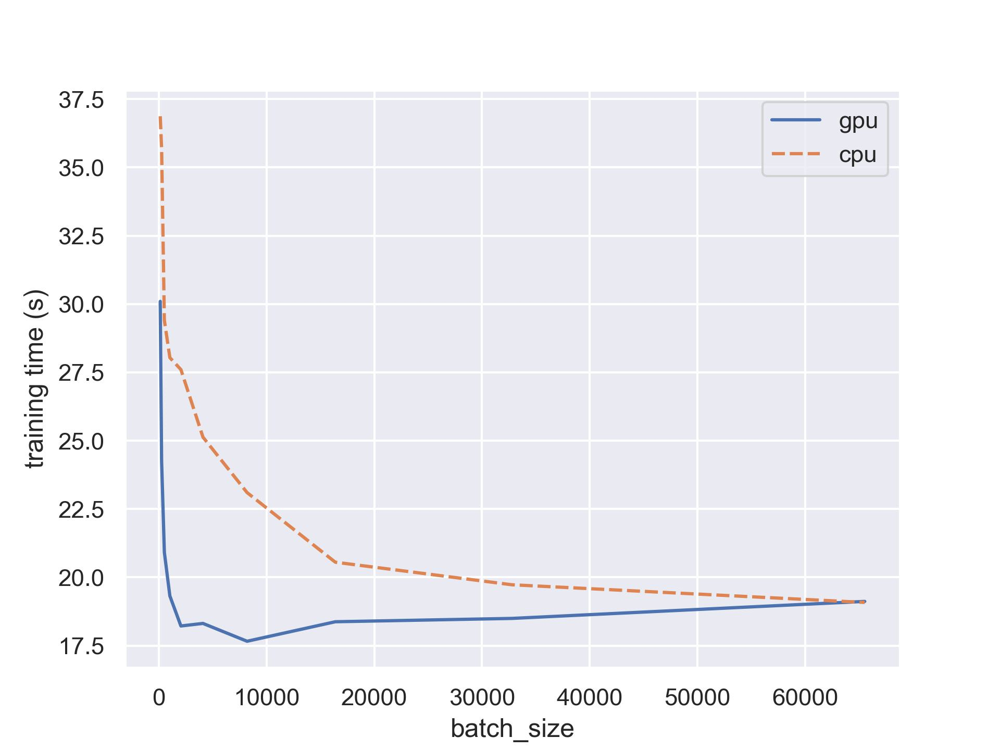

# torch-speed-test

測試 MacOS 的 CPU 與 GPU 效能

- Test 1 : 2層網路
  
```python
layers = 
    [
        nn.Linear(in_features=784, out_features=128),
        nn.ReLU(),
        nn.Linear(in_features=128, out_features=10),
        nn.LogSoftmax(dim=1)
    ]
```


- Test 2 : 4層網路
  
```python
layers = 
    [  
        nn.Linear(in_features=784, out_features=512),
        nn.ReLU(),
        nn.Linear(in_features=512, out_features=128),
        nn.ReLU(),
        nn.Linear(in_features=128, out_features=32),
        nn.ReLU(),
        nn.Linear(in_features=32, out_features=10),
        nn.LogSoftmax(dim=1)
    ]
```
